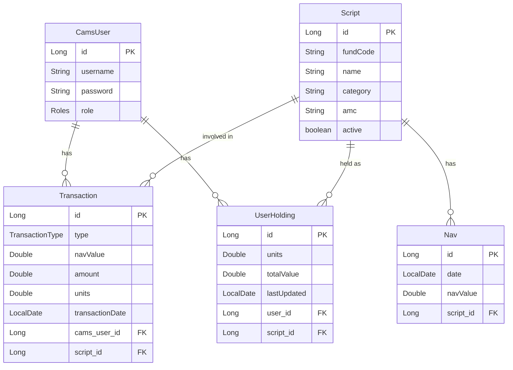

# Mutual Fund Management System

## Use of Generative AI
**Full Disclosure**
Generative AI has been used to generate boilerplate code such as DTOs/similar classes, CRUD methods, Unit Tests, repetitive annotations, to save time and focus on functionlity of the service. 
However, **all project code decisions, domain modeling, business logic, and overall flow** were designed and implemented by me.


## Overview
The Mutual Fund Management System is the backend service for managing mutual fund investments, transactions, and user portfolios.

## Technology Stack
- **Java 21** - Latest LTS version for optimal performance and security
- **Spring Boot 3.5.0** - Core framework for application development
- **Spring Security** - Authentication and authorization with role-based access control
- **Spring Data JPA** - Data persistence with Hibernate ORM
- **H2 Database** - In-memory database for development and testing
- **Log4j2** - Advanced logging framework with security enhancements
- **SpringDoc OpenAPI** - API documentation with Swagger UI
- **JUnit 5 & Mockito** - Comprehensive testing framework
- **Maven** - Dependency management and build automation
- **OWASP Dependency Check** - Security vulnerability scanning
- **JaCoCo** - Code coverage analysis with 70% minimum coverage requirement

## Security Implementation
The application implements a security model using Spring Security with Basic Authentication:

- Role-based access control (ADMIN, USER)
- BCrypt password encoding for secure credential storage
- Protected API endpoints with appropriate role restrictions
- Public access to Swagger UI and H2 console for development purposes

## Key Features
- **User Management** - Registration, authentication, and role-based authorization
- **Portfolio Management** - Track and manage investment portfolios
- **Transaction Processing** - Buy, sell, and track mutual fund transactions
- **NAV Tracking** - Monitor Net Asset Value for mutual funds
- **Script Management** - Comprehensive mutual fund script handling
- **Admin Dashboard** - Administrative controls for system management
- **Exception Handling** - Global exception handling with appropriate HTTP status codes

## Design patterns implemented/identified/observed
- **Facade** - Implemented - UserTransactionFacade
- **Template Method Pattern** - Identified - Could also use this between buy and redeem
- **Strategy** - Alternatively, could use strategy pattern for transaction request
  - Each transaction type would implement an interface with .execute() method that would be called.
  - This strategy would be dynamically injected behaviour to the facade class.
- **Builder** - Identified - For transaction requests (Yet to implement)
- **Singleton** - Observed - Implemented by Spring for bean creation
- **Dependency Inversion** - Observed - Implemented by Spring for bean injection
- **Repository** - Observed - Implemented by Spring Data JPA repository
- **Observer** - Identified - Upon every transaction, could register a list of observers to be called like notification, triggers, reports etc


## Entity Relationships
- **CamsUser** - Core user entity with OneToMany relationship to Transaction
- **Transaction** - Records user transactions with ManyToOne relationship to CamsUser
- **UserHolding** - Tracks user's mutual fund holdings
- **Script** - Represents mutual fund schemes
- **Nav** - Tracks Net Asset Value for mutual funds

## ER Diagram



## Exception Handling
The application implements a comprehensive exception handling strategy:

- **GlobalExceptionHandler** - Centralized exception handling with @ControllerAdvice
- **Custom HTTP Status Codes** - Appropriate status codes based on exception type:
  - 400 Bad Request for IllegalArgumentException
  - 404 Not Found for NoSuchElementException
  - 500 Internal Server Error for general RuntimeException
- **Custom Exceptions** - Domain-specific exceptions like DuplicateUsernameException

## API Documentation
The API is fully documented using SpringDoc OpenAPI:

- **Swagger UI** - Available at `/swagger-ui.html`
- **OpenAPI Specification** - Available at `/v3/api-docs`

## Setup and Installation

### Prerequisites
- Java 21 JDK
- Maven 3.8+

### Build and Run
```bash
# Clone the repository
git clone <repository-url>

# Navigate to project directory
cd mutualfund

# Build the project
mvn clean install

# Run the application
mvn spring-boot:run
```

### Access Points
- **Application** - http://localhost:8080
- **H2 Console** - http://localhost:8080/h2-console
- **Swagger UI** - http://localhost:8080/swagger-ui.html

## Testing
The application includes comprehensive test coverage:

- **Unit Tests** - Testing individual components in isolation
- **MockMvc Tests** - Testing REST endpoints
- **JaCoCo Coverage** - Enforcing minimum 80% code coverage

Run tests with:
```bash
# Run tests
mvn test

# Run tests with coverage report
mvn test -Pcoverage
```

## Security Scanning
The project includes OWASP Dependency Check for security vulnerability scanning:

```bash
# Run security scan
mvn dependency-check:check
```

## Best Practices Implemented
- Global exception handling for consistent error responses
- Uniform response structure for error and success scenarios
- Role-based security with proper endpoint protection
- Code coverage enforcement with JaCoCo (over 90%)
- Security vulnerability scanning with OWASP for dependencies used
- Easier unit testing by opting for constructor injection over setter injection
- Interface to promote depending on abstraction and facilitate easier mocks during testing
- SOLID and DRY design
- Identified the potential places for implementing design pattern
- OpenAPI documentation
- Custom exceptions (implemented 1 for reference)
